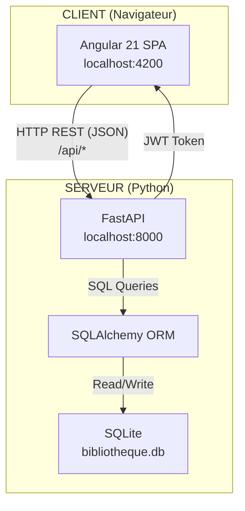
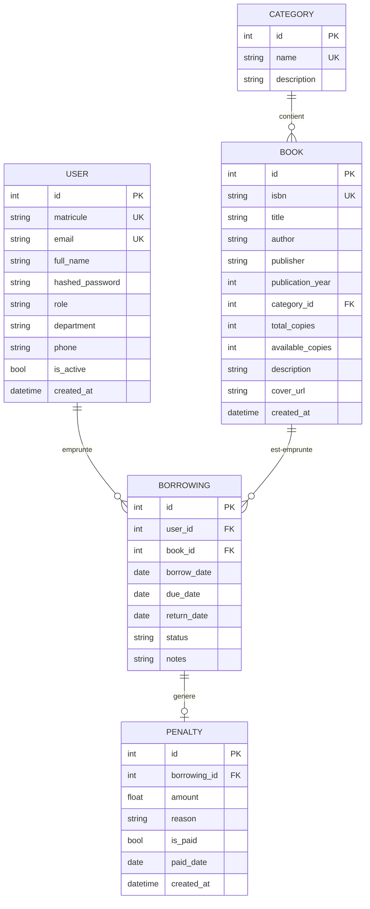
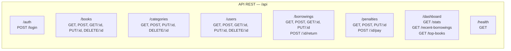
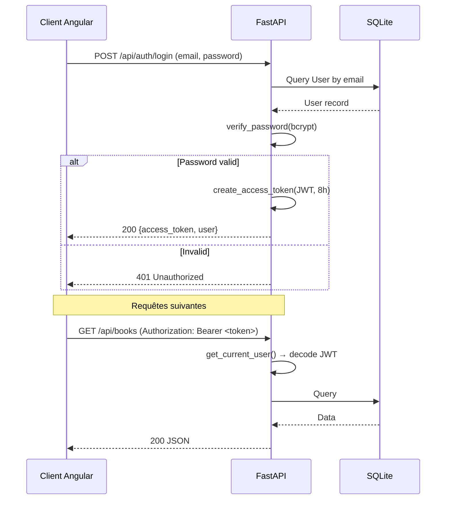
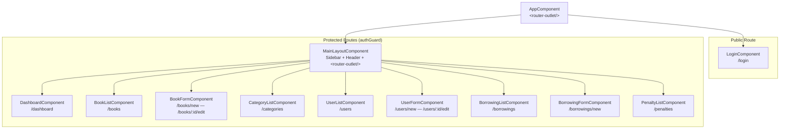
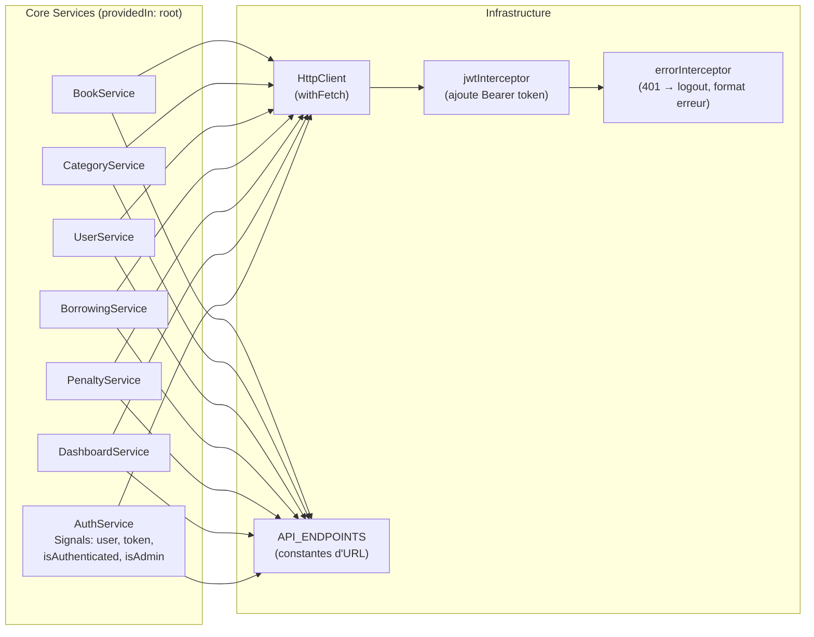
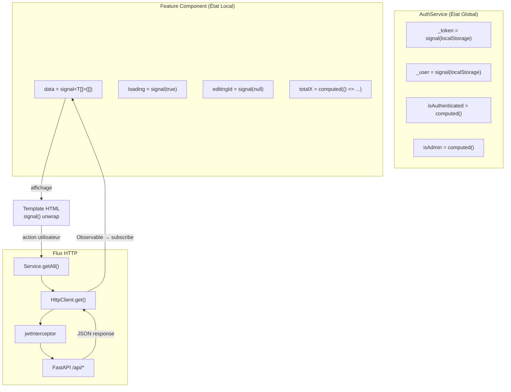
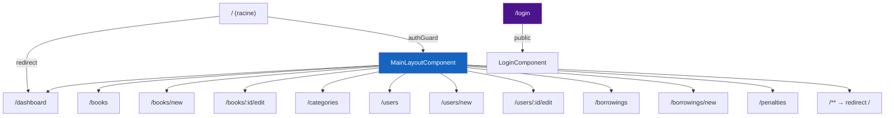
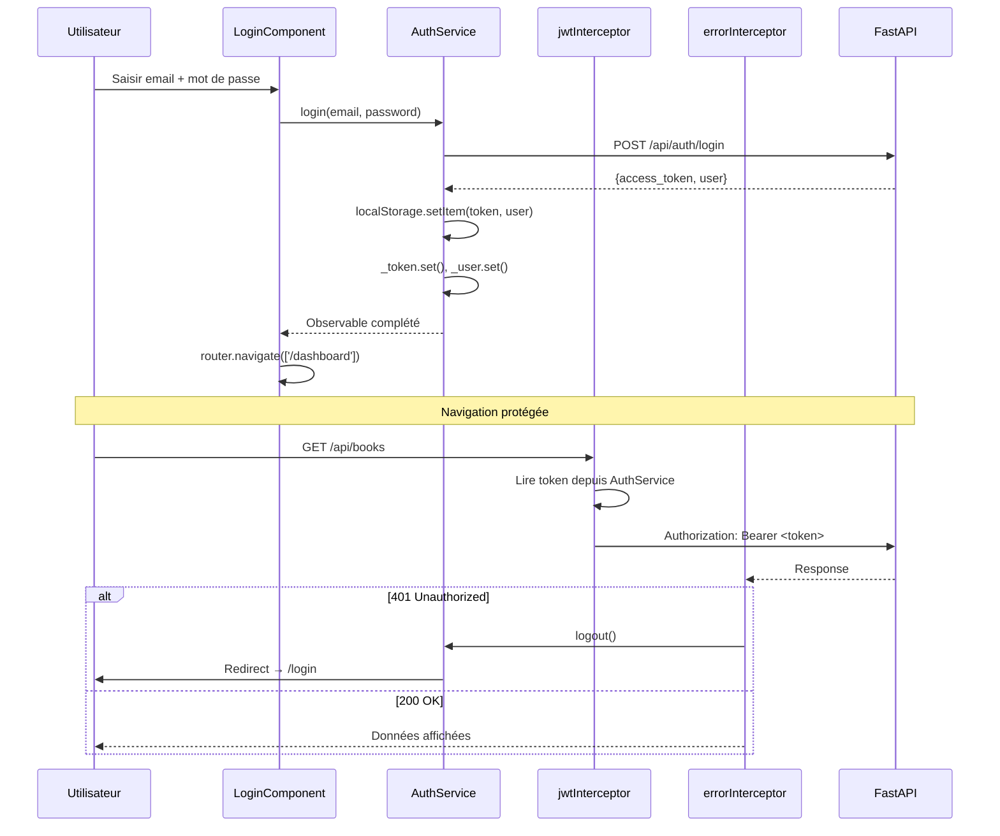
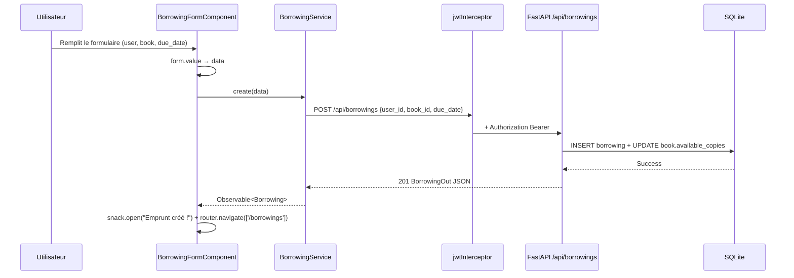

# 📐 Architecture Complète — BiblioUniv

> Système de Gestion de Bibliothèque Universitaire  
> **Angular 21** (Standalone) + **FastAPI** (Python) + **SQLite**

---

## 1. Vue Globale de l'Application

### 1.1 Stack Technologique

| Couche | Technologie | Version |
|--------|-------------|---------|
| **Frontend** | Angular (Standalone Components) | `^21.0.0` |
| **UI Kit** | Angular Material | `^21.0.0` |
| **TypeScript** | TypeScript | `5.9` |
| **Backend** | FastAPI (Python) | `0.115.6` |
| **ORM** | SQLAlchemy | `2.0.36` |
| **Validation** | Pydantic | `2.10.3` |
| **Base de données** | SQLite | fichier local |
| **Auth** | JWT (python-jose) + bcrypt | — |
| **Serveur ASGI** | Uvicorn | `0.32.1` |

### 1.2 Architecture Haut Niveau



### 1.3 Domaine Métier



### 1.4 Rôles Utilisateurs

| Rôle | Permissions |
|------|-------------|
| **admin** | Accès complet : CRUD tous domaines, gestion utilisateurs, paiement pénalités |
| **librarian** | Identique à admin (même guard côté backend) |
| **teacher** | Consultation livres, emprunts personnels, vue dashboard |
| **student** | Consultation livres, emprunts personnels, vue dashboard |

---

## 2. Architecture Backend (FastAPI)

### 2.1 Structure des Fichiers

```
backend/
├── main.py                 # Point d'entrée FastAPI, CORS, inclusion des routers
├── database.py             # Connexion SQLAlchemy, session factory, Base
├── models.py               # Modèles SQLAlchemy (5 tables + 2 enums)
├── schemas.py              # Schémas Pydantic (DTOs : Create, Update, Out)
├── auth.py                 # JWT + bcrypt : création/vérification tokens, guards
├── seed.py                 # Script de peuplement initial (10 catégories, 12 livres, 6 users, 5 emprunts)
├── requirements.txt        # Dépendances Python
└── routers/
    ├── __init__.py          # Exports des routers
    ├── auth_router.py       # POST /api/auth/login
    ├── books.py             # CRUD /api/books
    ├── categories.py        # CRUD /api/categories
    ├── users.py             # CRUD /api/users
    ├── borrowings.py        # CRUD /api/borrowings + POST .../return
    ├── penalties.py         # CRUD /api/penalties + POST .../pay
    └── dashboard.py         # GET /api/dashboard/stats, recent-borrowings, top-books
```

### 2.2 Endpoints API



### 2.3 Flux d'Authentification Backend



### 2.4 Schéma DTOs (Pydantic)

Chaque entité suit le pattern **Base → Create → Update → Out** :

| Entité | Base | Create | Update | Out |
|--------|------|--------|--------|-----|
| Category | `name, description?` | = Base | tous optionnels | + `id` |
| Book | `isbn, title, author, publisher?, year?, category_id?, copies, desc?, cover?` | = Base | tous optionnels | + `id, available_copies, created_at, category?` |
| User | `matricule, email, full_name, role, department?, phone?` | + `password` | tous optionnels + `is_active?, password?` | + `id, is_active, created_at` |
| Borrowing | `user_id, book_id, due_date, notes?` | = Base | `due_date?, return_date?, status?, notes?` | + `id, borrow_date, return_date?, status, user?, book?` |
| Penalty | `borrowing_id, amount, reason` | = Base | `amount?, reason?, is_paid?, paid_date?` | + `id, is_paid, paid_date?, created_at, borrowing?` |

---

## 3. Architecture Frontend (Angular 21)

### 3.1 Structure des Fichiers

```
frontend/src/
├── main.ts                          # bootstrapApplication(AppComponent, appConfig)
├── app/
│   ├── app.ts                       # AppComponent (standalone, template: <router-outlet/>)
│   ├── app.config.ts                # ApplicationConfig : providers globaux
│   ├── app.routes.ts                # Routes principales + lazy loading
│   │
│   ├── core/                        # Singleton services, guards, interceptors
│   │   ├── constants/
│   │   │   └── api.constants.ts     # API_BASE_URL + API_ENDPOINTS
│   │   ├── models/
│   │   │   └── index.ts             # Interfaces TS : Category, Book, User, Borrowing, Penalty, etc.
│   │   ├── services/
│   │   │   ├── auth.service.ts      # AuthService (Signals : user, token, isAuthenticated, isAdmin)
│   │   │   └── index.ts             # BookService, CategoryService, UserService, BorrowingService,
│   │   │                            # PenaltyService, DashboardService
│   │   ├── guards/
│   │   │   └── auth.guard.ts        # authGuard + adminGuard (CanActivateFn)
│   │   └── interceptors/
│   │       └── index.ts             # jwtInterceptor + errorInterceptor (HttpInterceptorFn)
│   │
│   ├── layouts/
│   │   └── main-layout/             # Shell avec sidebar/header + <router-outlet/>
│   │
│   ├── features/                    # Feature modules (lazy loaded)
│   │   ├── auth/
│   │   │   └── login/               # LoginComponent (.ts, .html, .scss)
│   │   ├── dashboard/               # DashboardComponent
│   │   ├── books/
│   │   │   ├── book-list/           # BookListComponent
│   │   │   └── book-form/           # BookFormComponent (create + edit)
│   │   ├── categories/
│   │   │   └── category-list/       # CategoryListComponent (CRUD inline)
│   │   ├── users/
│   │   │   ├── user-list/           # UserListComponent
│   │   │   └── user-form/           # UserFormComponent (create + edit)
│   │   ├── borrowings/
│   │   │   ├── borrowing-list/      # BorrowingListComponent
│   │   │   └── borrowing-form/      # BorrowingFormComponent
│   │   └── penalties/
│   │       └── penalty-list/        # PenaltyListComponent
│   │
│   └── shared/
│       └── components/              # Composants réutilisables (à enrichir)
```

### 3.2 Diagramme de Composants



### 3.3 Architecture des Services



### 3.4 Flux de Données (State Management)

> **[!IMPORTANT]**
> L'application utilise le **pattern Signals d'Angular 21** pour la gestion d'état, **sans NgRx ni store externe**. Chaque composant gère son état local via des `signal()` et `computed()`.



#### Pattern de chargement dans chaque composant :

```typescript
// 1. Déclaration (signal local)
items    = signal<Item[]>([]);
loading  = signal(true);

// 2. Chargement via service
load() {
  this.loading.set(true);
  this.svc.getAll()
    .pipe(takeUntilDestroyed(this.destroyRef))
    .subscribe({
      next: (data) => { this.items.set(data); this.loading.set(false); },
      error: ()    => this.loading.set(false),
    });
}

// 3. Template (unwrap signal)
@if (loading()) { <mat-spinner/> }
@for (item of items(); track item.id) { ... }
```

### 3.5 Routing & Lazy Loading



> **[!TIP]**
> Toutes les routes utilisent `loadComponent: () => import(...)` pour le **lazy loading** automatique. Chaque feature est un chunk JS séparé.

### 3.6 Sécurité & Authentification (Frontend)



| Mécanisme | Implémentation |
|-----------|---------------|
| **Token Storage** | `localStorage` (access_token + user JSON) |
| **Token Injection** | `jwtInterceptor` (HttpInterceptorFn) |
| **Expiration** | 8h côté backend (JWT `exp` claim) |
| **Auto-logout** | `errorInterceptor` sur HTTP 401 |
| **Route Protection** | `authGuard` (CanActivateFn) |
| **Admin Protection** | `adminGuard` (CanActivateFn) |
| **Refresh Token** | ❌ Non implémenté (single token, 8h) |

### 3.7 Communication entre Composants

| Pattern | Utilisation dans l'app |
|---------|----------------------|
| **Signal + inject()** | État local dans chaque composant (`signal()`, `computed()`) |
| **Service partagé** | `AuthService` injecté dans tous les composants (user, rôle, token) |
| **toSignal()** | `DashboardComponent` convertit les Observable→Signal pour un binding réactif |
| **Template @if/@for** | Control flow blocks d'Angular 17+ (pas de `*ngIf`, `*ngFor`) |
| **Router params** | `ActivatedRoute.snapshot.paramMap.get('id')` pour les formulaires d'édition |
| **MatSnackBar** | Notifications globales pour les confirmations/erreurs |
| **Input/Output** | Non utilisé actuellement (composants autonomes, pas de hiérarchie parent-enfant complexe) |

### 3.8 Gestion des Environnements

| Aspect | Actuel |
|--------|--------|
| **API Base URL** | Codée en dur : `http://localhost:8000/api` dans `api.constants.ts` |
| **CORS Origins** | `localhost:4200` et `127.0.0.1:4200` dans `main.py` |
| **Dev Server** | `ng serve` (port 4200) + `uvicorn --reload` (port 8000) |
| **Build Prod** | `ng build` → `dist/bibliotheque/` |
| **Environment files** | ❌ Non utilisés (Angular `environment.ts` absent) |

> [!WARNING]
> Pour la production, il faudrait :
> - Créer `environment.ts` / `environment.prod.ts` pour l'URL de l'API
> - Changer le `SECRET_KEY` JWT dans `auth.py`
> - Migrer de SQLite vers PostgreSQL/MySQL
> - Ajouter un mécanisme de refresh token

---

## 4. Résumé des Caractéristiques Architecturales

| Critère | Choix Actuel |
|---------|-------------|
| **Taille du projet** | Application de taille **moyenne** (7 features, 5 entités) |
| **Architecture Angular** | **Standalone Components** (pas de NgModule) |
| **State Management** | **Signals natifs** (pas de NgRx/Akita) |
| **Lazy Loading** | ✅ Chaque feature est lazy-loaded via `loadComponent` |
| **Design Pattern** | Feature-based folder structure (Core / Features / Shared / Layouts) |
| **Réactivité** | `signal()`, `computed()`, `toSignal()`, `takeUntilDestroyed()` |
| **UI Framework** | Angular Material 21 (Material 3 / M3) |
| **Backend Pattern** | Router-based (chaque entité = 1 router FastAPI) |
| **ORM Pattern** | Active Record via SQLAlchemy relationships |
| **Auth Pattern** | JWT stateless (token unique, 8h, pas de refresh) |
| **Monorepo** | ❌ Non (pas de Nx), structure simple `backend/` + `frontend/` |

---

## 5. Flux Complet — Exemple : Emprunter un Livre



---

## 6. Points d'Amélioration Potentiels

| Domaine | Suggestion |
|---------|-----------|
| **Refresh Token** | Implémenter un endpoint `/auth/refresh` avec rotation de token |
| **Environment Config** | Ajouter `environment.ts` / `environment.prod.ts` pour les URL dynamiques |
| **Pagination** | Ajouter `skip/limit` côté API et infinite scroll côté front |
| **Error Handling** | Centraliser via un `ErrorHandler` Angular global |
| **Tests** | Ajouter Jasmine/Karma pour les services et composants |
| **CI/CD** | GitHub Actions pour build + lint + tests |
| **Base de données** | Migrer de SQLite vers PostgreSQL pour la production |
| **Role Guard** | `adminGuard` n'est pas appliqué à toutes les routes qui le nécessitent |
